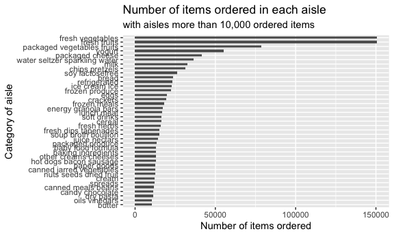
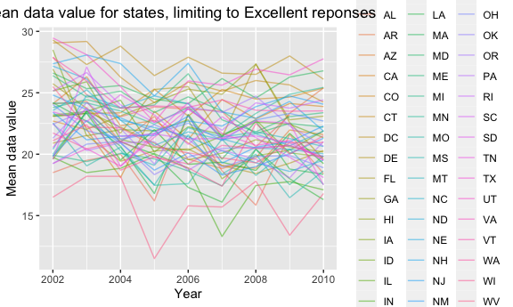
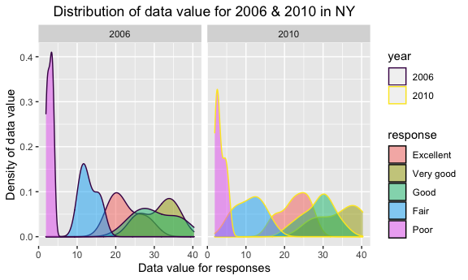
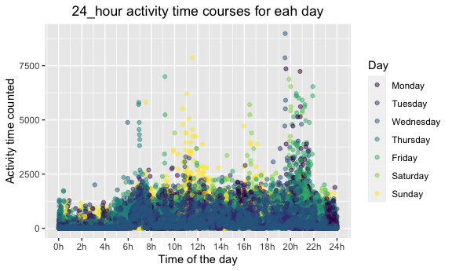

p8105\_hw3\_kx2173
================
ke

``` r
library(tidyverse)
```

    ## ── Attaching packages ─────────────────────────────────────── tidyverse 1.3.1 ──

    ## ✓ ggplot2 3.3.5     ✓ purrr   0.3.4
    ## ✓ tibble  3.1.4     ✓ dplyr   1.0.7
    ## ✓ tidyr   1.1.3     ✓ stringr 1.4.0
    ## ✓ readr   2.0.1     ✓ forcats 0.5.1

    ## ── Conflicts ────────────────────────────────────────── tidyverse_conflicts() ──
    ## x dplyr::filter() masks stats::filter()
    ## x dplyr::lag()    masks stats::lag()

``` r
knitr::opts_chunk$set(
  fig.width = 6,
  fig.asp = .6,
  out.width = "90%"
)
```

## Problem 1

Load the data from package.

``` r
library(p8105.datasets)
data("instacart")
```

This data set has 15 columns and 1384617 rows, with 15 variables
including order\_id, product\_id, add\_to\_cart\_order, reordered,
user\_id, eval\_set, order\_number, order\_dow, order\_hour\_of\_day,
days\_since\_prior\_order, product\_name, aisle\_id, department\_id,
aisle, department. What’s more, reordered shows 1 if this product has
been ordered by this user in the past, 0 otherwise; eval\_set means
which evaluation set this order belongs i; order\_dow means the day of
the week on which the order was placed.

For example, the first row in data set means a person with order id
112108 bought a product with id 49302, it was ordered on the 4th day of
the week. The product name is Bulgarian Yogurt belonging to yogurt aisle
in dairy eggs department.

``` r
instacart %>% 
  janitor::clean_names() 
```

    ## # A tibble: 1,384,617 × 15
    ##    order_id product_id add_to_cart_order reordered user_id eval_set order_number
    ##       <int>      <int>             <int>     <int>   <int> <chr>           <int>
    ##  1        1      49302                 1         1  112108 train               4
    ##  2        1      11109                 2         1  112108 train               4
    ##  3        1      10246                 3         0  112108 train               4
    ##  4        1      49683                 4         0  112108 train               4
    ##  5        1      43633                 5         1  112108 train               4
    ##  6        1      13176                 6         0  112108 train               4
    ##  7        1      47209                 7         0  112108 train               4
    ##  8        1      22035                 8         1  112108 train               4
    ##  9       36      39612                 1         0   79431 train              23
    ## 10       36      19660                 2         1   79431 train              23
    ## # … with 1,384,607 more rows, and 8 more variables: order_dow <int>,
    ## #   order_hour_of_day <int>, days_since_prior_order <int>, product_name <chr>,
    ## #   aisle_id <int>, department_id <int>, aisle <chr>, department <chr>

#### How many aisles are there, and which aisles are the most items ordered from?

``` r
instacart %>% 
  group_by(aisle) %>% 
  summarize(n_obs = n()) %>% 
  arrange(desc(n_obs))
```

    ## # A tibble: 134 × 2
    ##    aisle                          n_obs
    ##    <chr>                          <int>
    ##  1 fresh vegetables              150609
    ##  2 fresh fruits                  150473
    ##  3 packaged vegetables fruits     78493
    ##  4 yogurt                         55240
    ##  5 packaged cheese                41699
    ##  6 water seltzer sparkling water  36617
    ##  7 milk                           32644
    ##  8 chips pretzels                 31269
    ##  9 soy lactosefree                26240
    ## 10 bread                          23635
    ## # … with 124 more rows

There are 134 aisles, and the item “fresh vegetables” is the most item
ordered from.

#### Make a plot that shows the number of items ordered in each aisle, limiting this to aisles with more than 10000 items ordered. Arrange aisles sensibly, and organize your plot so others can read it.

``` r
instacart %>% 
  group_by(aisle) %>% 
  summarize(n_obs = n()) %>% 
  filter(n_obs > 10000) %>% 
  mutate(aisle = fct_reorder(aisle, n_obs)) %>% 
  ggplot(aes(x = n_obs, y = aisle)) + 
  geom_col(width = .5,
           position = position_dodge(width = 1)) +
  labs(title = "Number of items ordered in each aisle",
       subtitle = "with aisles more than 10,000 ordered items",
       x = "Number of items ordered",
       y = "Category of aisle"
       )
```



#### Make a table showing the three most popular items in each of the aisles “baking ingredients”, “dog food care”, and “packaged vegetables fruits”. Include the number of times each item is ordered in your table.

``` r
baking_ingredients = instacart %>% 
  filter(aisle == "baking ingredients") %>% 
  group_by(aisle, product_name) %>% 
  summarize(n_obs = n()) %>% 
  arrange(desc(n_obs)) %>% 
  head(3)
```

    ## `summarise()` has grouped output by 'aisle'. You can override using the `.groups` argument.

``` r
dog_food_care = instacart %>% 
  filter(aisle == "dog food care") %>% 
  group_by(aisle, product_name) %>% 
  summarize(n_obs = n()) %>% 
  arrange(desc(n_obs)) %>% 
  head(3)
```

    ## `summarise()` has grouped output by 'aisle'. You can override using the `.groups` argument.

``` r
packaged_vegetables_fruits = instacart %>% 
  filter(aisle == "packaged vegetables fruits") %>% 
  group_by(aisle, product_name) %>% 
  summarize(n_obs = n()) %>% 
  arrange(desc(n_obs)) %>% 
  head(3)
```

    ## `summarise()` has grouped output by 'aisle'. You can override using the `.groups` argument.

``` r
table_three = 
  bind_rows(baking_ingredients, dog_food_care, packaged_vegetables_fruits) 

knitr::kable(table_three)
```

| aisle                      | product\_name                                 | n\_obs |
|:---------------------------|:----------------------------------------------|-------:|
| baking ingredients         | Light Brown Sugar                             |    499 |
| baking ingredients         | Pure Baking Soda                              |    387 |
| baking ingredients         | Cane Sugar                                    |    336 |
| dog food care              | Snack Sticks Chicken & Rice Recipe Dog Treats |     30 |
| dog food care              | Organix Chicken & Brown Rice Recipe           |     28 |
| dog food care              | Small Dog Biscuits                            |     26 |
| packaged vegetables fruits | Organic Baby Spinach                          |   9784 |
| packaged vegetables fruits | Organic Raspberries                           |   5546 |
| packaged vegetables fruits | Organic Blueberries                           |   4966 |

#### Make a table showing the mean hour of the day at which Pink Lady Apples and Coffee Ice Cream are ordered on each day of the week; format this table for human readers.

``` r
mean_hr_of_two = instacart %>% 
  filter(product_name %in% c("Pink Lady Apples", "Coffee Ice Cream")) %>%
  group_by(product_name, order_dow) %>% 
  summarise(mean_hr = 
            round(mean(order_hour_of_day, na.rm = TRUE),digits = 2), 
            .groups = "drop") %>% 
  mutate(order_dow = recode(order_dow,
                            `1` = "Monday",
                            `2` = "Tuesday",
                            `3` = "Wednesday",
                            `4` = "Thursday",
                            `5` = "Friday",
                            `6` = "Saturday",
                            `0` = "Sunday")) %>% 
  pivot_wider(
    names_from = "order_dow",
    values_from = "mean_hr"
  )

knitr::kable(mean_hr_of_two,
             caption = "Mean hour of the day for which Pink Lady Apples and Coffee Ice Cream are ordered")
```

| product\_name    | Sunday | Monday | Tuesday | Wednesday | Thursday | Friday | Saturday |
|:-----------------|-------:|-------:|--------:|----------:|---------:|-------:|---------:|
| Coffee Ice Cream |  13.77 |  14.32 |   15.38 |     15.32 |    15.22 |  12.26 |    13.83 |
| Pink Lady Apples |  13.44 |  11.36 |   11.70 |     14.25 |    11.55 |  12.78 |    11.94 |

Mean hour of the day for which Pink Lady Apples and Coffee Ice Cream are
ordered

## Problem 2

Load data from package.

``` r
library(p8105.datasets)
data("brfss_smart2010")
```

#### Do some data cleaning.

``` r
brfss_clean = brfss_smart2010 %>% 
  janitor::clean_names() %>% 
  filter(topic == "Overall Health",
         response %in% c("Excellent", "Very good", "Good", "Fair", "Poor")) %>% 
  mutate(response = 
           fct_relevel(response, 
                       c("Excellent", "Very good", "Good", "Fair", "Poor"))) %>%
  arrange(desc(response))
```

#### In 2002, which states were observed at 7 or more locations? What about in 2010?

``` r
location_2002 = brfss_clean %>% 
  filter(year == "2002") %>% 
  select(year:locationdesc) %>% 
  distinct() %>% 
  group_by(locationabbr) %>% 
  summarize(n_obs = n()) %>% 
  filter(n_obs >= 7) %>% 
  arrange(desc(n_obs))

location_2010 = brfss_clean %>% 
  filter(year == "2010") %>% 
  select(year:locationdesc) %>% 
  distinct() %>% 
  group_by(locationabbr) %>% 
  summarize(n_obs = n()) %>% 
  filter(n_obs >= 7) %>% 
  arrange(desc(n_obs))
```

##### In 2002, there are 6 states (PA, MA, NJ, CT, FL, NC) observed at 7 or more locations, and in 2010, there are 14 states (FL, NJ, TX, CA, MD, NC, NE, WA, MA, NY, OH, CO, PA, SC) observed at 7 or more locations.

#### Construct a dataset that is limited to Excellent responses, and contains, year, state, and a variable that averages the data\_value across locations within a state. Make a “spaghetti” plot of this average value over time within a state

``` r
brfss_clean %>% 
  filter(response == "Excellent") %>% 
  group_by(year, locationabbr) %>% 
  summarise(mean_data_value = round(mean(data_value, na.rm = TRUE), digits = 2), 
            .groups = "drop") %>% 
  ggplot(aes(x = year, y = mean_data_value, color = locationabbr)) +
  geom_line(alpha = .5) +
  labs(
    title = "Mean data value for states, limiting to Excellent reponses",
    x = "Year",
    y = "Mean data value",
  ) +
  theme(legend.position = "right",
        plot.title = element_text(hjust = 0.6 ))
```



#### Make a two-panel plot showing, for the years 2006, and 2010, distribution of data\_value for responses (“Poor” to “Excellent”) among locations in NY State.

``` r
brfss_clean %>% 
  filter(year %in% c(2006, 2010),
         locationabbr == "NY") %>%
  group_by(year, response) %>% 
  summarise(data_value) %>% 
  mutate(year = as.character(year)) %>% 
  ggplot(aes(x = data_value, color = year, fill = response)) +
  geom_density(alpha = .5) +
  facet_grid(. ~year) +
  labs(
    title = "Distribution of data value for 2006 & 2010 in NY",
    x = "Data value for responses",
    y = "Density of data value",
  ) +
  theme(plot.title = element_text(hjust = .5)) +
  scale_color_viridis_c() +
  scale_color_viridis_d()
```

    ## `summarise()` has grouped output by 'year', 'response'. You can override using the `.groups` argument.

    ## Scale for 'colour' is already present. Adding another scale for 'colour',
    ## which will replace the existing scale.



## Problem 3

#### Load, tidy, and otherwise wrangle the data.

``` r
accel_df = read_csv("data_problem3/accel_data.csv")
```

    ## Rows: 35 Columns: 1443

    ## ── Column specification ────────────────────────────────────────────────────────
    ## Delimiter: ","
    ## chr    (1): day
    ## dbl (1442): week, day_id, activity.1, activity.2, activity.3, activity.4, ac...

    ## 
    ## ℹ Use `spec()` to retrieve the full column specification for this data.
    ## ℹ Specify the column types or set `show_col_types = FALSE` to quiet this message.

``` r
accel_clean = accel_df %>% 
  janitor::clean_names() %>% 
  mutate(
    weekday_weekend = case_when(
    day == "Monday" ~ "Weekday",
    day == "Tuesday" ~ "Weekday",
    day == "Wednesday" ~ "Weekday",
    day == "Thursday" ~ "Weekday",
    day == "Friday" ~ "Weekday",
    day == "Saturday" ~ "Weekend",
    day == "Sunday" ~ "Weekend",
  ),
  day = as.factor(day),
  day = fct_relevel(day,
                    c("Monday", "Tuesday", "Wednesday", "Thursday", 
                      "Friday", "Saturday", "Sunday"))) %>% 
  relocate(week, day_id, day, weekday_weekend) %>% 
  pivot_longer(
    activity_1:activity_1440,
    names_to = "activity_min",
    names_prefix = "activity_",
    values_to = "activity_counts"
  ) %>% 
  mutate(
    activity_min = as.numeric(activity_min),
    weekday_weekend = as.factor(weekday_weekend)
    )
```

Describe the resulting dataset: This data set has 6 variables and 50400
observations. Variables are week, day\_id, day, weekday\_weekend,
activity\_min, activity\_counts. Here are variable descriptions: week:
Number of week. day\_id: Number of day. day: the day that related to
day\_id. weekday\_weekend: Whether it is a weekday or weekend.
activity\_min: Each activity minute. activity\_counts: The counts on
each activity minute.

#### Traditional analyses of accelerometer data focus on the total activity over the day.

``` r
accel_clean %>% 
  group_by(week, day) %>% 
  summarise(total_activity = sum(activity_counts),
            .groups = "drop") %>% 
  pivot_wider(
    names_from = day,
    values_from = total_activity
  ) %>% 
  knitr::kable(caption = "Total activity data over the day") 
```

| week |    Monday |  Tuesday | Wednesday | Thursday |   Friday | Saturday | Sunday |
|-----:|----------:|---------:|----------:|---------:|---------:|---------:|-------:|
|    1 |  78828.07 | 307094.2 |    340115 | 355923.6 | 480542.6 |   376254 | 631105 |
|    2 | 295431.00 | 423245.0 |    440962 | 474048.0 | 568839.0 |   607175 | 422018 |
|    3 | 685910.00 | 381507.0 |    468869 | 371230.0 | 467420.0 |   382928 | 467052 |
|    4 | 409450.00 | 319568.0 |    434460 | 340291.0 | 154049.0 |     1440 | 260617 |
|    5 | 389080.00 | 367824.0 |    445366 | 549658.0 | 620860.0 |     1440 | 138421 |

Total activity data over the day

Trend: Strictly, there is no apparent trend for the data on each day
over these five weeks, but it seems that the male is .

#### Make a single-panel plot that shows the 24-hour activity time courses for each day and use color to indicate day of the week.

``` r
accel_clean %>% 
  ggplot(aes(x = activity_min,y = activity_counts,color = day)) +
  geom_point(alpha = .5) +
  labs(
    title = "24_hour activity time courses for eah day",
    x = "Time of the day",
    y = "Activity time counted"
  ) +
  viridis::scale_color_viridis(
    name = "Day",
    discrete = TRUE) +
    scale_x_continuous(
    breaks = c(0, 120, 240, 360, 480, 600, 720, 840, 960, 1080, 1200, 1320, 1440),
    labels = c("0h", "2h", "4h", "6h", "8h", "10h", "12h", "14h", 
               "16h", "18h", "20h", "22h", "24h")
  ) +
  theme(plot.title = element_text(hjust = .5))
```


Conclusion: Based on the output graph, we can see that this 63 year-old
male is active at 7 am., at noon, at 4:30 pm on Thursday,Saturday and
Sunday, and is active at around 9 pm. on most of days(excluding Sunday).
